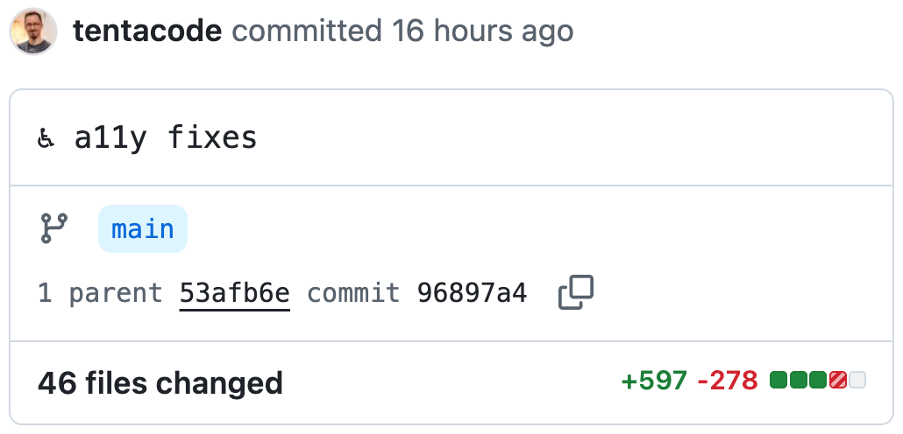

Je ne compte plus le nombre de fois où j'ai refait mon portfolio : ma carrière a évolué, je veux refaire le code pour qu'il corresponde plus à mes exigences, le design est dépassé, etc.

Mais cette fois c'était plutôt une excuse pour faire une expérience dans un contexte bien délimité : **quel est le niveau de l'I.A. générative (ici Claude) pour produire un site web simple accessible ?**

## Avant-propos

J'aimerais commencer par dire honnêtement que je ne me considère pas comme un expert en I.A., ni d'ailleurs en accessibilité numérique. Je suis avant tout développeur et j'essaye de me spécialiser dans l'accessibilité depuis 2 ans, j'ai suivi la formation [RGAA : auditer l'accessibilité numérique des sites web avec Access42](https://formations.access42.net/formations/formation-audit-accessibilite/), que je recommande, et je n'ai pas encore passé la certification. J'ai également développé une application destinée aux aveugles pour [biped.ai](https://biped.ai).

En ce qui concerne l'intelligence artificielle générative, j'ai utilisé des assistants d'autocomplétion depuis qu'ils existent, j'utilise Claude en complément depuis quelques années et je fais de plus en plus appel à des agents pour coder des fonctionnalités complètes, mais j'ai encore beaucoup à tester, les possibilités sont vraiment passionnantes (même si paradoxalement le coût environnemental fait peur).

Bref, cet article est à lire en prenant en compte qu'il est écrit par un développeur averti mais pas encore expert dans ces domaines. N'hésitez pas à [me faire un retour par email](mailto:hello@tentacode.dev) si je dis trop de bêtises. Contrairement à mon portfolio, cet article a été écrit à la main, sans I.A. (sauf pour la correction de l'orthographe 😅).

## La méthode

### Création du design system avec Claude Design

[Claude Design](https://claude.ai/design) est une interface qui permet de créer un design à partir d'un prompt, ou de créer un design system, encore à partir d'un prompt, qui pourra être utilisé pour générer un ou plusieurs designs. J'ai testé les deux approches et j'ai eu de bien meilleurs résultats en créant le design system d'abord. 

Quel prompt j'ai utilisé pour le design system ? Il est plutôt long et pas vraiment intéressant à avoir en détail, mais en gros :

* Je fais une petite présentation de mon profil.
* Je précise quels axes de mes compétences je souhaite mettre en avant.
* Je décris les différentes sections du portfolio.
* Je lui donne quelques codes couleurs et des fonts que j'aime bien issus d'[Ohdit](https://ohdit.com).
* Je donne une liste de contraintes : en français, pas de thème sombre, le fait que le projet sera transformé ensuite dans un projet [Astro](https://astro.build/).

Mais surtout j'ajoute cette contrainte sur l'accessibilité : 

> Le site doit être accessible, niveau WCAG AA. Éviter les composants interactifs qui sont difficiles à rendre accessible, sauf si nécessaire ou explicitement demandé (ex: menu mobile c'est ok).

Ce n'est pas grand-chose, pas d'utilisation de skills ou de serveur MCP sur l'accessibilité. Mais après tout, quand on demande à Claude Code de générer une application mobile avec React Native, elle en est capable non ? C'était un peu l'expérience que je voulais réaliser.

J'ai aussi dû ajouter dans le prompt des informations sur la direction artistique, et vu que je ne suis pas designer j'ai demandé à Claude de l'aide ici pour améliorer le prompt (en mode chatbot). Je fais souvent ça pour optimiser des prompts pour d'autres outils (Claude Design ou Claude Code par exemple), et jusqu'ici ça m'a bien aidé.

Visuellement le design system me plaît assez vite, je corrige quelques éléments rapidement dans l'interface de Claude Design (très pratique de pouvoir demander des changements en ciblant des parties de l'interface).

### Génération du projet avec Claude Code

Même principe, je demande à [Claude Code](https://claude.com/fr/product/claude-code) de me générer le projet Astro à partir du design system, en reprécisant dans le prompt mes contraintes d'accessibilité. 

Ensuite j'ai pris quelques jours à modifier le projet, pour écrire les textes, corriger des bugs, déployer le site. Vous pouvez trouver [l'historique sur github](https://github.com/tentacode/tentacode/commits/main/). Je n'ai pas encore vraiment touché à l'accessibilité à ce stade.

Accessibilité mise à part je suis assez satisfait de la génération de Claude Code, même si on ne peut s'empêcher d'avoir l'impression de se retrouver devant un code "étranger", il me faudrait un peu plus de travail pour créer des skills qui permettraient d'avoir un projet Astro qui corresponde vraiment à ma façon de coder.

La correction de bugs et l'ajout de nouvelles fonctionnalités complètes se fait assez facilement directement avec Claude, sans grosse surprise.

## L'audit d'accessibilité

Une fois le site stable, et seulement à ce moment, j'ai pris le temps de regarder les soucis d'accessibilité. **Autant le dire tout de suite, il y a du bon (un peu) et il y a du moyen bof (pas mal).**

J'ai essayé de faire un audit RGAA relativement complet, il est possible qu'il reste encore des soucis et si jamais vous en trouvez je serais ravi d'en avoir connaissance. J'ai utilisé mon cerveau, des extensions navigateur, des bookmarklets et des lecteurs d'écran (NVDA et VoiceOver).

Merci aussi à [Vanessa Strub](https://www.linkedin.com/in/vanessa-strub-3451773a/) qui a quasiment fait un contre audit et qui m'a beaucoup aidé. 🤗

### Ce qui a bien marché

Globalement Claude a bien utilisé la sémantique sur des composants simples, les titres (avec un bon respect de la hiérarchie), les textes, etc. Les balises de présentation sont aussi bien utilisées.

Les couleurs ont aussi été bien utilisées avec [des rapports de contraste niveau AA](https://www.accede-web.com/notices/fonctionnelle-graphique/couleurs/assurer-un-contraste-suffisant-entre-les-textes-et-larriere-plan/) de partout. Il faut dire que dans Astro c'était quelques variables CSS à créer, qui sont utilisées de partout, donc peu d'effort à fournir niveau I.A., mais c'est quand même à noter puisque les problèmes de contrastes représentent la majorité des problèmes d'accessibilité en volume. *Source : [The Automated Accessibility Coverage Report, en anglais](https://www.deque.com/automated-accessibility-coverage-report/)*

Une autre chose qui n'est pourtant pas si simple et a été correctement générée dès le départ, c'est l'utilisation du bon code pour les onglets dans la section témoignage (utilisation du pattern ARIA [tabs with automatic activation](https://www.w3.org/WAI/ARIA/apg/patterns/tabs/examples/tabs-automatic/)).

Difficile de lister tout ce qui a bien marché de manière exhaustive puisqu'on remarque plutôt les défauts. On va dire que globalement on est sur un niveau **"moyen mais pas catastrophique"** sur l'accessibilité, mais le diable se cache dans les détails.

### Ce qui a dû être corrigé

Au fur et à mesure, j'ai dû modifier 46 fichiers, ajouter 597 lignes et en supprimer 278. Vous pouvez accéder à la différence avant/après en lisant directement [le commit sur github](https://github.com/tentacode/tentacode/commit/96897a453069733c20cea18326dfe48671d1d367). Certaines modifications étaient aussi d'ordre esthétique mais la plupart sont des correctifs d'accessibilité.

Parmi les erreurs qu'on retrouve, on a des mauvaises utilisations de la sémantique :

* Les listes qui ne sont pas des `<ul><li>` mais des `
` (notamment le menu et les listes de tags).
* Une balise `<footer>` qui n'a rien à faire après les citations (encore qu'a priori, c'est toléré).
* Des balises `<article>` non nécessaires qui rajoutent de la verbosité au lecteur d'écran.
* Manque un titre `<h3>` sur les titres des conférences.
* Manque une citation courte `<q>` dans le footer.

La mauvaise utilisation d'attributs ARIA :

* Ajout d'un attribut `aria-describedby` qui n'apportait aucune information mais faisait doublon avec le lecteur d'écran.
* Des icônes SVG décoratives auxquelles manquaient les attributs `aria-hidden`.
* Des boutons avec juste une icône en mode mobile et sans `aria-label`.
* Une `
` avec un attribut `aria-hidden` alors qu'elle ne contient qu'une ``.

Ou des erreurs plus complexes et finalement pas étonnantes pour une I.A. :

* L'attribut `lang=fr` est bien renseigné sur la balise `<html>` mais aucun changement de langue n'a été ajouté, notamment sur les listes de tags qui contiennent de nombreux mots anglais qui étaient mal vocalisés au lecteur d'écran.
* Un "guillemet" décoratif dans les témoignages qui était vocalisé au lieu d'être ignoré.
* Manque de l'information "nouvelle fenêtre" sur l'étiquette d'un lien qui contient une icône indiquant un site externe.
* L'ordre d'affichage pas forcément compatible avec l'ordre attendu par le lecteur d'écran (on veut lire le titre, puis les tags par exemple, même si visuellement les tags apparaissent avant le titre), corrigé via la propriété CSS `order` de `flexbox` ou `grid`.
* Le zoom sur mobile était cassé.

À part ces erreurs, j'ai aussi corrigé un peu le html pour que ce soit plus fluide au lecteur d'écran (exemple : regrouper le nom et le métier sur l'onglet dans les témoignages), mais c'était plus de l'expérience utilisateur.

## Analyse

Finalement à quoi ça ressemble d'auditer un site qui a été généré via I.A. et à qui on a juste dit "S'il te plaît, fais du code accessible" ? Eh bien sans grande surprise ça ressemble beaucoup à n'importe quel site conçu sans vraiment réfléchir à l'accessibilité.

Certes il y a quelques efforts, notamment sur les contrastes et quelques consignes sont respectées, mais on retrouve à peu près les mêmes travers que les sites "codés par des humains sans vraiment chercher plus loin".

Alors pourquoi quand on demande à une I.A. "fais-moi un site avec Astro", elle y arrive sans problème ? (la preuve, cette partie de la génération était très bien gérée)

Eh bien ma théorie c'est qu'elle sait faire de l'Astro (et d'autres technos), mais moins de l'accessibilité naturellement, parce que les données d'entrainement des modèles sont très bonnes sur les frameworks et sont très mauvaises sur l'accessibilité.

Et au fond ça fait sens, on sait que l'I.A. est biaisée et reflète ses données d'entrainement, par exemple : [Comment l’IA renforce les préjugés sexistes](https://www.unwomen.org/fr/nouvelles/interview/2025/02/comment-lia-renforce-les-prejuges-sexistes-et-ce-que-lon-peut-faire-pour-tenter-dy-remedier). Et quand on regarde le niveau d'accessibilité (ou de non-accessibilité plutôt) du web aujourd'hui ([l'accessibilité du web recule au niveau mondial](https://lesbases.anct.gouv.fr/ressources/l-accessibilite-du-web-recule-au-niveau-mondial)), ce n'est pas très étonnant que l'I.A. de manière générale soit entrainée sur des projets non accessibles.

## Quelles pistes au final ?

**Est-ce qu'on doit arrêter d'utiliser l'I.A. générative pour produire des sites et des applications ?** Bien sûr que non, et puis de toute manière, on n'a pas vraiment le choix maintenant que la machine est lancée et que la plupart des équipes de développement utilisent l'I.A. au quotidien et de manière intensive.

Mais par contre si on veut faire de l'accessibilité, il va falloir aller plus loin qu'un simple prompt. Quelques pistes que j'imagine de mon côté :

* Continuer à former les développeur·euses (et toute l'équipe projet) à l'accessibilité. Aussi afin de mieux prompter l'I.A. quand on l'utilise.
* Continuer à tester de manière manuelle l'accessibilité avec tous nos outils, dont les lecteurs d'écran qui doivent être maitrisés dans l'équipe (ce qui n'est pas compliqué à apprendre).
* Développer des outils I.A. plus avancés (serveur MCP, skills) tournés vers l'accessibilité. Il en existe probablement d'ailleurs déjà, et c'est quelque chose que j'aimerais vraiment creuser personnelement si j'ai le temps.
* Pour les expert·es en accessibilité, s'intéresser aussi à l'I.A. et en parler. 😉