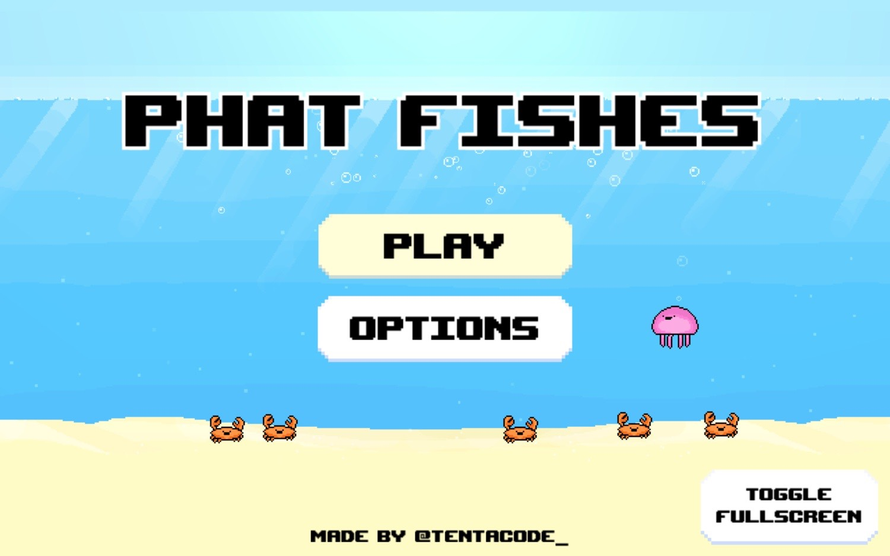
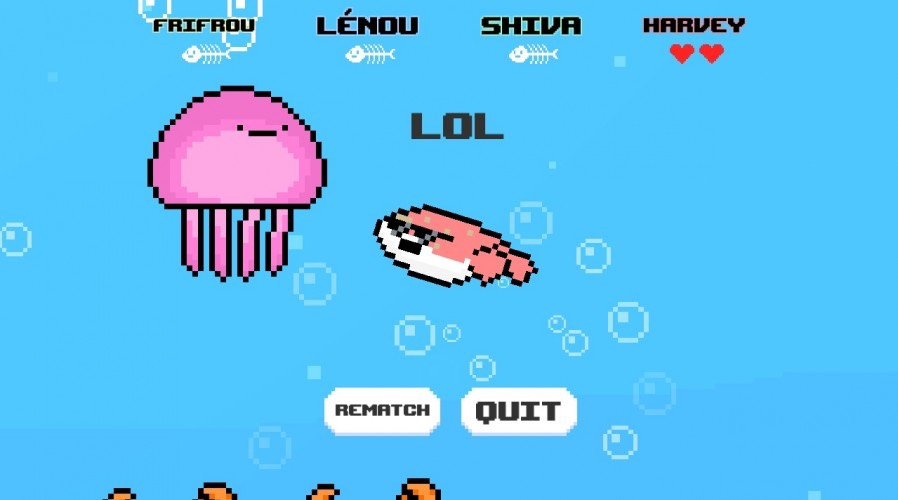

Phat Fishes est l'anagramme de Shapeshift, thème de la 35ème édition de la Ludum Dare. La Ludum Dare est une Game Jam : un événement spécial où il faut coder un jeu de zéro en un temps limité.

J'ai participé à plusieurs game jams mais Phat Fishes est ma plus grande fierté car j'ai tout fait seul en moins de 72 heures : le code, les graphismes, l'UI, les effets sonores et la musique !

C'est un jeu d'arène bête et méchant où jusqu'à 4 joueurs s'affrontent pour être le dernier poisson en vie. Le poisson est un Tétraodontidae qui peut se gonfler pour repousser les autres poissons dans les dangers de l'océan.

**Jouable directement dans le navigateur sur itch.io !**

**Stack :** Unity3D, C#, Aseprite, GarageBand.

