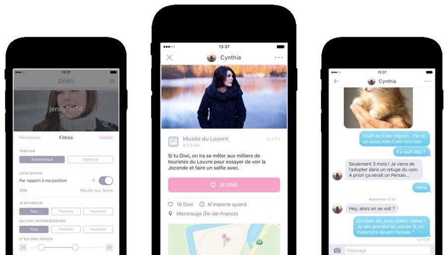

Diwi était une application de rencontres et mon premier projet chez Netcats. Face à la concurrence très forte sur le marché des apps de dating, le projet a été abandonné trois ans plus tard.

J'étais en charge de la gestion de projet, du développement backend (API REST, backend de modération) et j'ai également participé au développement de l'application Android en React Native.

**Stack :** PHP 7, Symfony 3, React Native, JavaScript, WebSockets, Redis, MySQL.

