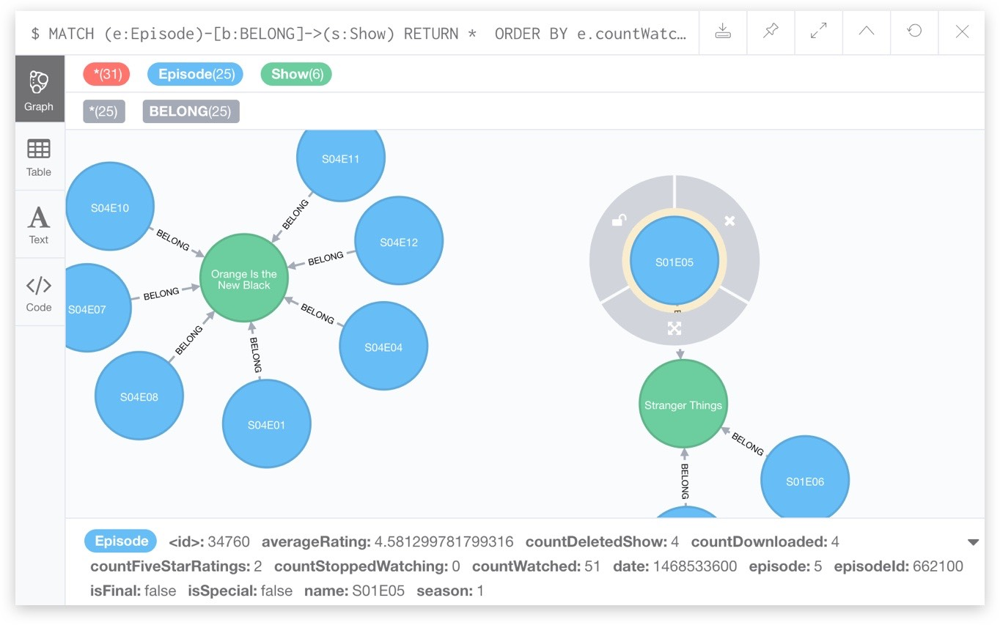
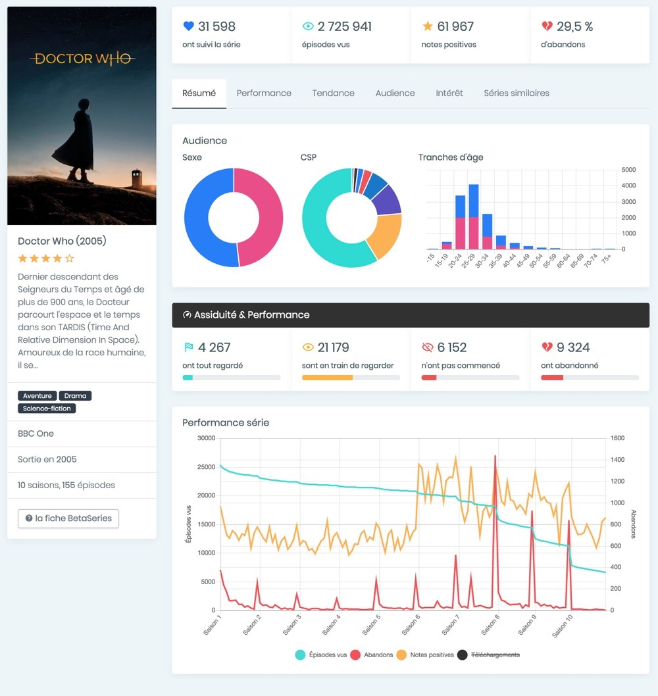

BetaSeries Insights est l'un de mes projets dont je suis le plus fier. L'objectif du site est de fournir des analyses de données sur la consommation de séries TV à des professionnels des médias.

Avec plus d'un million de membres et 200 000 épisodes regardés par jour, c'était un vrai défi de trouver la bonne solution pour faire des analytics en temps réel (statistiques sur une série précise, audiences, tendances…). Nous avons choisi Neo4j, une base de données graphe qui correspond parfaitement au modèle relationnel profond de BetaSeries.

BetaSeries Insights est un projet solo — j'ai tout fait, des exports/imports de données jusqu'au frontend du site B2B.

**Stack :** PHP 7, Symfony 4, Neo4j, SQL, Redis, Ansible.

