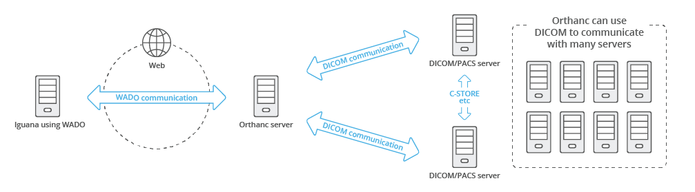
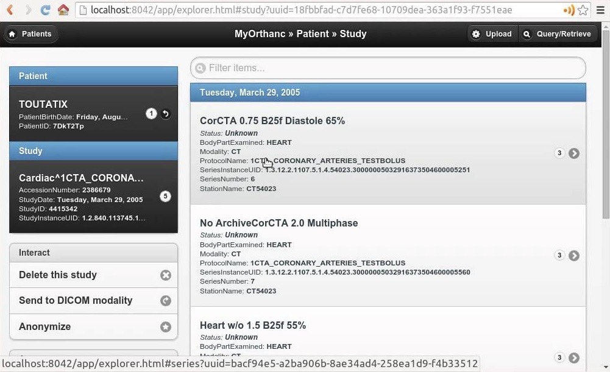

Ce projet challengeant était pour une entreprise de santé confidentielle. L'objectif de l'application est de fournir un moteur de recherche d'imagerie médicale (IRM par exemple) pour classifier et retrouver les meilleures images.

La complexité réside dans la segmentation de l'information, qui peut être répartie sur plusieurs serveurs distants et doit être récupérée et calculée localement. J'ai travaillé avec la spécification DICOM et le serveur open source Orthanc. J'ai eu la chance de démarrer le projet from scratch et de préconiser l'architecture, en utilisant Symfony avec les composants Workflow et Messenger.

**Stack :** PHP 7, Symfony 4, Elasticsearch, Orthanc, SQL, Ansible.

